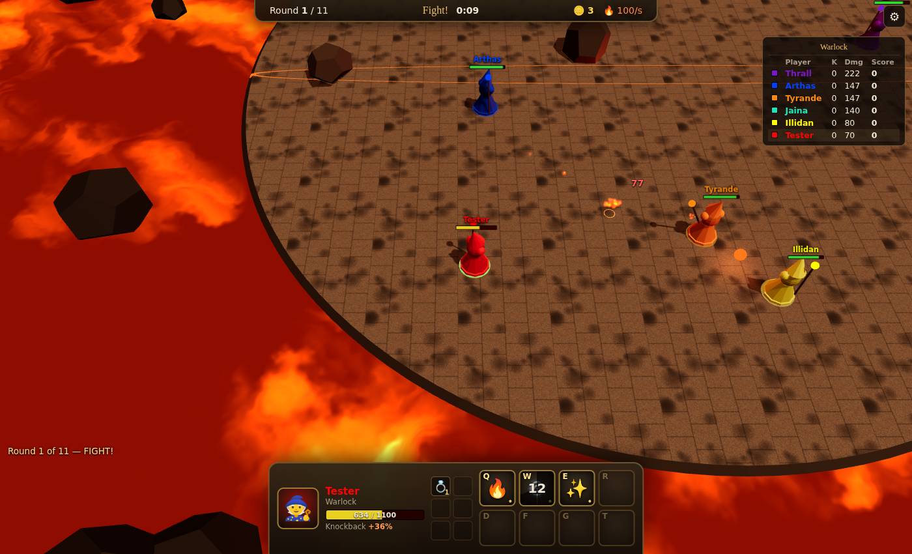

# 🔥 Arcane Arena

> **Early access.** The game is playable but still being built. Expect bugs, balance changes and missing spells.

Arcane Arena is a browser remake of **Warlock**, the classic Warcraft III custom map. Every player is a warlock on a stone platform surrounded by lava:

- **Knockback kills, not spells.** Spells do little damage but knock you back, and every point of damage you take makes the next hit throw you further. The lava does the killing.
- **Shrinking arena.** The platform shrinks as the round goes on.
- **Rounds and shop.** The last warlock standing wins the round. Between rounds you buy and upgrade spells and items.



**Play:** https://tenggames.com.au/arcane-arena/

## Features

- **Up to 10 players online.** Peer-to-peer multiplayer with no game server: the host's browser runs the match, and friends join with a 4-letter code or an invite link.
- **Bots** to fill the lobby or practise against.
- **Warcraft III feel:**
  - Right-click movement with WC3's turn rate and propulsion window: units turn before they walk, and turns become arcs.
  - A 0.3 s cast point during which the warlock turns toward the target.
  - The original knockback formula.
  - For tuning: a Movement Lab overlay (F8) and host commands (`-turnrate`, `-propwindow`, `-castpoint`).
- **Spells:**
  - Fireball and Scourge;
  - one spell per shop column: Lightning, Homing, Boomerang, Teleport, Thrust, Swap, Drain, Bouncer, Meteor, Windwalk, Shield, Rush, Gravity, Link;
  - items;
  - obstacles, shields that reflect projectiles, and Lightning detonating a Fireball.
- **Graphics and sound** are generated in code with Three.js and WebAudio. There are no asset files.

## Development

```bash
npm install
npm run dev        # dev server with hot reload → http://localhost:5173
npm test           # headless bot games + multiplayer test
npm run build      # static site → dist/
```

`npm run serve` builds and runs the optional Node server, which hosts rooms over WebSockets. You can also use the `Dockerfile` for that. The published site doesn't need it.

## Deployment

The game is published at **tenggames.com.au/arcane-arena/** as part of the Teng Games site ([JTstacky/Chess-tutor](https://github.com/JTstacky/Chess-tutor)). As with the site's other games, the built files are committed into that repo at `public/arcane-arena/`.

On every push to `main`, `.github/workflows/publish.yml` tests and builds, then commits the build to the site as "Arcane Arena: update to the latest build". The site's own deploy then publishes it.

That step needs the repository secret `SITE_DEPLOY_TOKEN`: a fine-grained token with access to Chess-tutor only and **Contents: Read and write**. Without the secret, run `scripts/update-games.sh` in Chess-tutor and commit the result.

## How it works

```
client/   game client: entry (main.js), HUD + shop (hud.js), host worker
server/   warlock.js: rules, spells, knockback, lava, shop, bots
shared/   warlockData.js: spell and item tables (used by server and client)
engine/   shared engine (also used by Hammerguy's Party):
          sim, rooms, networking, renderer, input, HUD base
docs/     research.md: findings from the original Warlock 1.02 map
          wc3-observations.md: measured behaviour from real WC3, via wc3-instrumentation/
```

**Networking.** The simulation runs at 30 Hz on the host, and snapshots go out at 15 Hz. Clients send only orders and interpolate between snapshots.

- **Peer-to-peer (default):** the host's browser runs the room in a Web Worker, and guests connect over WebRTC via [PeerJS](https://peerjs.com). The public PeerJS server only introduces players. To use your own, build with `VITE_PEER_HOST` and related variables.
- **Dedicated:** `server.js` runs the same room code behind a WebSocket.

The engine is copied here and in [Hammerguy's Party](https://github.com/JTstacky/Hammerguy-s-Party). Port engine fixes across when they matter to both games.

## Credits

Inspired by *Warlock* by Zymoran and Adynathos. The rules and numbers are based on the original map and on the authors' [Warlock Brawl](https://github.com/warlockbrawl/warlock). Warcraft is a trademark of Blizzard Entertainment. This fan-made game contains no Blizzard assets.
