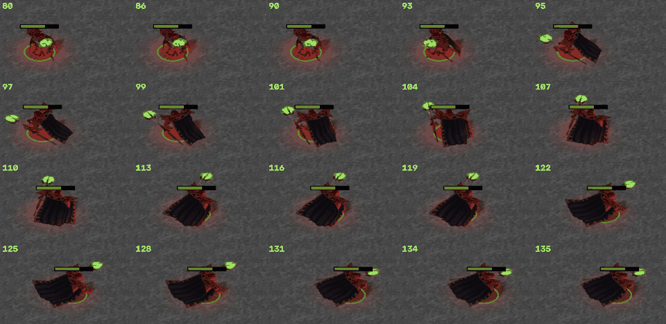
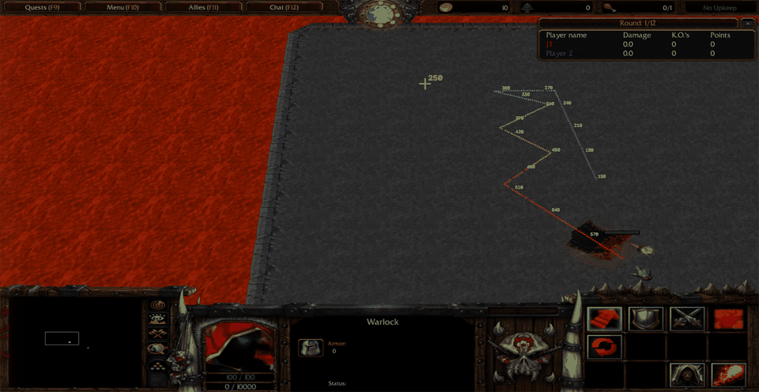
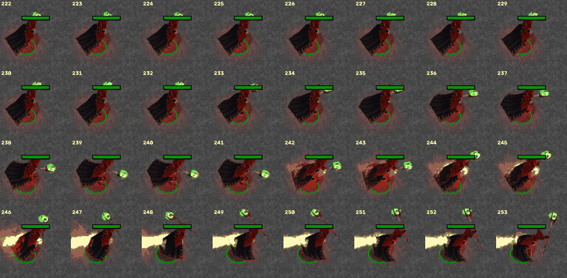
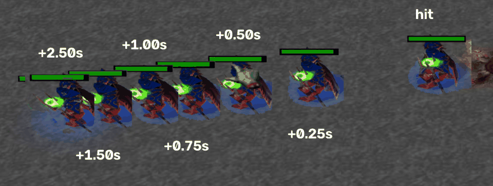

# Warlock in the real Warcraft III: measured behaviour

These are measurements from playing the real map in Warcraft III on this PC. Their purpose is to let the
browser remake match the original's feel. Each section covers one test: the numbers (in frames, then
seconds), what I saw, and how it compares with `docs/research.md`.

The measurements come from two sources:

- **Video.** 60 fps recordings of me playing, timed frame by frame.
- **Engine log.** A copy of the map with a logger added (section 10). It records the engine's own values
  every 0.01 s: position, facing, order, HP, mana and knockback velocity. It also records every order and
  spell event, and runs scripted experiments. Where the two disagree, the log is right. Sections 1–6 give
  the video result first and the exact log result after it, under **Engine log**.

> **Important: the installed map is not the one `research.md` describes.**
>
> - `research.md` was written from **Warlock v1.02**.
> - The copy on this PC is **`Maps/Download/Warlock 099.w3x`**: Warlock **0.99** by Zymoran and Deme[SanD].
>   `Warlock_099.w3x` is the same file.
> - Its script is plain World Editor output, not obfuscated, so I could read every rule directly.
> - Several rules differ from v1.02: collision, the knockback formula, lava damage, the arena shape and
>   shrinking, and the economy. See [section 8](#8-map-and-engine-data-v099-script-and-object-data).
> - Everything measured below agrees with the 0.99 script.

## Setup and method

**Game and map**
- Warcraft III: The Frozen Throne **1.26a** (`war3.exe` 1.26.0.6401), windowed.
- The client area is 2856×1476 on a 4K monitor.
- Version 1.26 renders a 4:3 image and stretches it to the window, so on-screen x distances are 1.451×
  wider than true.
- **Video sessions:** a Local Area Network game that I hosted alone, at game speed Fast. (An earlier
  version of this note said "single-player". That was wrong: it was a LAN lobby with no other humans.)
  - I was red.
  - Player 2 was a computer slot. The map has no AI, so its warlock just stands still.
  - The game was in round 1 of 12.
- **Engine-log session:** a real single-player custom game (Single Player → Custom Game), with the same
  slots and round.

**Capture**
- ffmpeg `ddagrab` (desktop duplication) at 60 fps, cropped to the game's client area.
- 1 frame = 16.7 ms.
- On screen, a walking warlock's position changes about 37–39 times a second, so that is roughly how
  often WC3 draws a new frame.
- Game time runs at real time at game speed Fast:
  - Fireball lifetime is 33 script ticks × 0.03 s = 0.99 s, and I measured 59 frames (0.98 s).
  - In the logged session, experiment trials 3.5 game seconds apart were 210 video frames (3.5 s) apart.
- **Caveat for automated play.** In the single-player session, clicks sent by the automation tool made
  WC3's whole main loop stall, not just the drawing. The gaps between drawn frames grew from 2 to about
  35 video frames. Two clicks 1.5 s apart were processed at the same game time. The scripted
  experiments were not affected: their logs advance exactly 0.01 s per sample. But I could not measure
  single-player click latency (see section 10).

**Analysis**
- OpenCV tracked each unit's **health bar** in every frame. The bar is 128 px wide at any depth, and
  its centre follows the unit.
- **Order time** is the frame where WC3's green order-confirmation arrows first appear at the click
  point. They are drawn immediately on the client.
- Unit **reaction** is the first frame where the bar moves more than 1.5 px.
- Clips: `walk_north`, `turn180_a`, `turns_b`, `turns_c`, `turns_d`, `zigzag_a`, `cast_a`, `cast_bc`,
  `cancel_a`, `cancel_b`, `lava_a`, `kb_hit1`, `kb_hit2`, `kb_hit3`. They were not committed.

**Converting pixels to game units**
- The camera is WC3's perspective view. A pixel is worth fewer units near the bottom of the screen.
- I calibrated with two distances that the 0.99 script defines exactly:
  - A 7-damage hit on a fresh warlock slides 0.72 × 107 × 7 = **539 units**.
  - A Fireball flies **960 units**.
- Horizontal walking speed in pixels changes linearly with the screen row. At the health-bar row it
  measured:

  | Screen row | Walking speed |
  |---|---|
  | 247 | 5.30 px/frame |
  | 458 | 5.87 px/frame |
  | 589 | 6.21 px/frame |
  | 987 | 7.05 px/frame |

## Summary for the remake

| Behaviour | Measured in WC3 | Notes |
|---|---|---|
| Walk speed | **210 u/s** exactly (2.10 u per 0.01 s in the log) | There is no acceleration and no deceleration: the unit starts at full speed and stops dead. |
| Where the engine does its turning | Once every **0.03 s per unit**, at a phase of its own | Each unit has its own 0.03 s "step". A new order waits 0–0.03 s for the next step. |
| Turn rate | **0.6 = 0.6 radians per 0.03 s step** (34.4° per step, 1146°/s) | This is the *logical* heading, which decides where the unit walks. |
| Propulsion window | **60°**, tested against the heading *before* that step's turn | If the check passes, the unit walks during the step along the *new* heading. |
| Walking starts after (standing, turn θ) | Step 1 for θ ≤ 60°, 2 for ≤ 94°, 3 for ≤ 129°, 4 for ≤ 163°, 5 for ≤ 180° | 180°: the unit walks after 0.12–0.15 s, first leaning 8° off the line, then straight. |
| Model rotation | A separate, slower display facing: 4°, 8°, then at most 11.5° per step (0.2 rad) | `GetUnitFacing` and the drawn model use this one. They lag, so after a 180° order the unit **slides backwards for about 0.35 s**. |
| Order → first movement in the LAN videos (no turn needed) | **8–10 frames (0.13–0.17 s)** | The engine part is only 0–0.03 s. The rest is the LAN command delay and input/draw time. |
| Order → movement in the LAN videos, 180° turn | **16–19 frames (0.27–0.32 s)**, mean 17.5 frames (0.29 s) | Engine part 0.12–0.15 s, which matches the step model. |
| Direction change while walking | Translation **stops at once** on a new order, then resumes on the first step that passes the window | 90°: 0.03–0.06 s with no progress, then one step cutting the corner 21° short. 180°: a 0.12–0.15 s stop. Re-clicking the same direction costs a hitch of up to 0.03 s. |
| Arrival | Stops dead **10.7–12.1 u** short of the clicked point; the order ends | No slow-down. |
| Fireball cast start | **Instant** if already facing. Otherwise on the step *after* the heading reaches the target exactly. | Logged at 30°: 0.046 s, 90°: 0.107 s, 180°: 0.179 s. |
| Fireball launch | At the start of the cast ("begins casting"), then a **0.300 s cast point** in which the unit is locked | Right-clicking during the wind-up did **not** cancel it. |
| Fireball flight | 30 u per 0.03 s = **1000 u/s**, 33 steps | The hit test (radius 75 in data) runs once per 30 u step. The logged hit came at 60 u. |
| Fireball cooldown | 5.0 s from the spell-effect event, so about 5.3 s launch to launch | The icon agrees. |
| Knockback | Hit: Δv = **0.03·D·(100+M)** units per step, where M is damage taken **including** this hit. Then **×0.9600 per 0.03 s** | Total slide = 24·Δv = **0.72·D·(100+M)**: 539 u (M=7), 756 u (M=50), 1008 u (M=100) for a 7-damage fireball. |
| Lava | **1.0 damage every 0.100 s** in round 1, +1 damage taken per tick | Regen of 0.5 HP/s continues in lava. |
| Arena | A square that does **not** shrink over time | It shrinks only when a warlock dies or a player leaves. |
| Camera | Distance 1650, angle of attack 304° (56° down), FOV 70°, rotation 90° | This is the WC3 default. The target sits on the ground (z −128 here). |

---

## 1. 180° turn from standing

**Method.**
1. Walk the warlock in one direction and let it stop, so its facing is known.
2. Right-click far directly behind it.
3. Repeat with 90° and 0° (straight-ahead) controls.

**Delay from order to the first visible step:**

| Turn | Samples (frames) | Mean |
|---|---|---|
| 0° (already facing) | 10, 8, 10 | **9.3 frames = 0.16 s** |
| 90° | 13, 9, 13, 9 | **11 frames = 0.18 s** |
| about 130–150° | 18, 15 | 16.5 frames = 0.28 s |
| 180° | 17, 19, 18, 16 (plus 16 from an unknown start facing) | **17.5 frames = 0.29 s** |

**What I saw:**
- **There is a fixed latency of about 0.15 s between the click and any reaction, even when no turn is
  needed.**
  - The confirmation arrows appear immediately, and the unit responds about 9 frames later.
  - This is WC3's order or command-turn latency. It is part of the "WC3 feel": orders never act on the
    frame you click.
- **Turning costs almost nothing up to 90° and about 0.14 s extra at 180°.**
  - This fits a unit that starts walking once it faces within about 60° of the target (the propulsion
    window).
  - A 180° order needs about 120° of turning first. A 90° order needs only about 30°, which is within
    noise.
  - From video alone, two models fit these timings: a constant turn of about 850°/s, or a proportional
    turn. **The engine log below settles it:** it is a constant 34.4° per 0.03 s step (1146°/s),
    tested against the window *before* each step's turn.
- **The warlock does not finish turning on the spot.** The contact sheets show:
  - The unit starts sliding toward the target while the *model* is still visibly rotating.
  - The rendered rotation completes about 6–10 frames (about 0.1–0.17 s) after movement starts.
  - WC3 draws the model's facing smoothly behind the logical facing.
- **It moves in a straight line from the first step.** For 90° and 180° orders the path was a straight
  line from the start point to the target, with no visible arc and no sideways drift.
  - One diagonal order of about 150° went straight "down-screen" for 20 frames before bending toward
    the target. With the strong perspective and the unit near the screen edge I could not decide
    whether that was a real kink. The engine log below shows it was real: a single first step along
    the partly turned heading.
- **It reaches full speed immediately.**
  - The first displacement was 4.5–8.5 px, against normal steps of 5–10 px.
  - There is no acceleration ramp.
- **Whole about-face:** from the click to straight full-speed walking is about 0.3 s. The visual turn
  finishes about 0.4 s after the click.

**Compared with `research.md`:**
- The note expects "about 0.33 s" for the about-face. That matches the total, but most of it is
  latency: the turning part is only about 0.14 s.
- The note's "engine caps turning at about 0.2 rad per frame, roughly 382°/s" would give 120°/382°/s =
  0.31 s of turning plus latency, about 0.47 s. That is **not** what the game does. The turn is at
  least twice as fast.
  - The engine log below shows where that 0.2 rad figure comes from: it is the cap on the *model's*
    rotation, not on the unit's steering.



*180° order, 60 fps frames 80–135. From frame 95 the warlock slides right (east, toward the click)
while its model is still facing west and then north. It only faces east from about frame 122.*

### Engine log: how turning really works

The log answers the open question from the first version of this note. A unit has **two** facings.

**1. The heading.** This is the direction the unit steers by.
- It turns in **steps of 0.03 s**. Each unit has its own step phase, so the first step after an order
  comes 0–0.03 s later.
- Each step turns it by at most the **turn rate in radians**: 0.6 rad = 34.4° per step, 1146°/s.
- Before the turn, the step checks the propulsion window. If the heading is within **60°** of the
  target, the unit walks during this step.
- It walks along the heading **after** this step's turn.
- Walking itself is continuous: the logged position moves 2.10 u every 0.01 s, at full speed from the
  first tick.

**2. The display facing.** This is what `GetUnitFacing` returns and what the model shows.
- It chases the heading. It turns 4.0°, then 8.0°, then at most 11.46° per step (0.2 rad, 382°/s).
  With turn rates below 0.2, the cap is the turn rate itself.
- It eases into the final angle, covering about 60–75% of the remaining angle per step.
- A 180° turn takes it about 0.5 s. So the unit visibly **walks backwards or sideways for about 0.35 s**.
  The frames above show this.

**Measured on standing turns** (turn rate 0.6, window 60°; the order is at step 0):

| Turn | Walks from step | First walking direction (logged) | Step model |
|---|---|---|---|
| 0° | 1 | 0.0° | step 1, 0.0° |
| 15° | 1 | 14.8° | step 1, 15.1° |
| 30° | 1 | 30.0° | step 1, 30.1° |
| 45° | 1 | 34.1° | step 1, 34.4° |
| 60° | 2 | 59.8° | on the edge: step 1 or 2 |
| 75° | 2 | 68.2° | step 2, 68.8° |
| 90° | 2 | 68.7° | step 2, 68.8° |
| 105° | 3 | 102.9° | step 3, 103.1° |
| 120° | 3 | 103.8° | step 3, 103.1° |
| 135° | 4 | 135.0° | step 4, 135.3° |
| 150° | 4 | 137.3° | step 4, 137.5° |
| 165° | 5 | 165.1° | step 5, 165.3° |
| 180° | 5 | 171.8° | step 5, 171.9° |
| −45°, −90°, −150° | 1, 2, 4 | −34.3°, −68.8°, −137.3° | the same, mirrored |

- The first walking step can point up to 34° off the line to the target. After that step the heading
  is on target, so the path is a nearly straight line with a tiny kink at the start.
  - This is the "went straight down-screen, then bent" diagonal that I could not resolve on video.
- **The same model holds for other turn rates and windows.**
  - The experiment set the warlock's turn rate to 0.1, 0.2, 0.3, 0.45, 0.6, 1.0, 1.5 and 3.0. It
    predicted the start step and first direction in 23 of 24 trials. The miss started from an
    unsettled facing.
  - It set the propulsion window to 1°, 15°, 30°, 45°, 60°, 90°, 120° and 180°: 24 of 24 trials
    matched.
  - So *turn rate* is radians per 0.03 s step. The *propulsion window* is a gate on the pre-turn
    heading.

## 2. 90° turns and zig-zags

**Method.** I walked north, then right-clicked alternately left and right, every 0.45 s. A path plot
with one dot per frame showed the result.

**Path shape.**
- Straight legs with **sharp V corners**. There are no arcs at the camera's resolution, so any radius is
  under about 10 units.
- Each leg heads straight for its click point.

**Timing per direction change** (angles converted to world directions with the camera fit, ±5°):

| Click frame | Direction change | Pause at the corner | Click → new heading |
|---|---|---|---|
| 250 | about 76° | none | 10 frames |
| 298 | about 152° | stopped about 6 frames (3–4 ticks) | 13 frames |
| 346 | about 113° | stopped about 3 frames | 10 frames |
| 395 | about 94° | stopped about 3 frames | 13 frames |
| 444 | about 89° | stopped 2–3 frames | 10 frames |
| 491 | about 84° | none | 9–11 frames |

**What this shows:**
- When a new order needs more turning than the propulsion window allows, the warlock **stops dead**,
  turns in place, and then walks at full speed again.
  - Big reversals cost a few ticks.
  - Changes up to about 80° flow straight into the new leg.
- **Speed is always full speed.** The per-tick step is constant along every leg, with no easing into or
  out of corners, and the unit stops dead at its destination.
- **Position steps.** The health bar changes position about 37–39 times a second while walking, in
  1- and 2-frame steps, and about 34 times a second while sliding from knockback.
  - The engine log corrects my first explanation of this. Walking is **not** stepped at 0.03 s: the
    engine moves the unit 2.10 u every 0.01 s. The 37–39 Hz is how often WC3 drew a frame.
  - Knockback *is* stepped: the map script moves the warlock with `SetUnitX/SetUnitY` once every
    0.03 s. The same is true of fireballs.
  - So a 60 fps remake should draw walking smoothly. Only script-driven motion (knockback and
    projectiles) moves in 33 Hz steps in the original.



*Zig-zag test. One dot per frame, labelled with frame numbers. The legs are straight and the corners
are sharp.*

**Compared with `research.md`:** "never speeds up or slows down on normal ground" is confirmed.
- There is **no ice in 0.99**. The script's friction is always 0.96 and nothing changes it.

### Engine log: turning while walking

The warlock walked east at full speed. After 1 s it got a new move order at an angle θ.

- **The unit stops translating the moment the order arrives**, even for θ = 0°.
- It walks again on the first 0.03 s step whose pre-turn heading is within 60° of the new target: the
  same rule as from standing.
- The start steps and first directions were identical to the standing turns, in all 16 trials:

  | θ | Pause before walking again | First step direction |
  |---|---|---|
  | 0–45° | Up to the next step, 0–0.03 s | Straight, or 34.4° when θ = 45° |
  | 60–90° | 0.03–0.06 s | 60°, or 68.8° when θ is 75–90° |
  | 105–120° | 0.06–0.09 s | 103° |
  | 135–150° | 0.09–0.12 s | 135–137.5° |
  | 165–180° | 0.12–0.15 s | 165–172° |

- **The path shape.** Each leg is straight. For θ above 60° the corner is cut by a single 0.03 s step
  (6.3 u) along the intermediate heading. That is the "sharp V with no visible arc" on video.
- **Order spam.** Re-clicking ahead of a walking unit costs up to 0.03 s of standing still each time.
  Spam-clicking therefore makes a WC3 unit very slightly *slower*.

## 3. Walking speed

**Measured speed.**
- The two rulers give walking speeds of:

  | Ruler | Walking speed |
  |---|---|
  | Knockback hit 1 (539 units) | **206 u/s** |
  | Knockback hit 3 (610 units) | **207 u/s** |
  | Knockback hit 2 (575 units, diagonal, less reliable) | 220 u/s |
  | Fireball flight (960 units from the caster's centre to where it vanished) | **212 u/s** |

- Walking is **210 u/s to within about 3%**, the same as the data (`umvs` 210).
- **Engine log:** exactly 2.09–2.10 u per 0.01 s, which is 210 u/s, from the first moving tick to the
  last.
  - At the destination the unit stops dead, **10.7–12.1 u short** of the clicked point, and its order
    ends.
  - That is just under half its collision size of 25.
- In 0.99 the script re-reads the engine's position every tick and adds only the knockback velocity. So
  walking *is* the plain WC3 engine walk. There is no fixed 6.3-unit step as in the v1.02 notes.

**Straight walk timings.**
- 766 screen rows from row 183 to row 950 took **228 frames (3.80 s)**, about 800 units at 210 u/s.
- A horizontal walk at the screen centre covers about **6.5 px/frame**, which is 1.85 px per unit in the
  stretched window.

**Size on screen.**
- The warlock's green selection circle is about 130 px wide (stretched) near the bottom of the view,
  about **65 units**. My measurement is rough, because the green staff glow gets in the way.
- **In one second it walks about 3–3.5 selection-circle widths.**
- Its health bar is 128 px wide at every depth. That spans about 85 units of ground at the top of the
  view and about 65 at the bottom.

**What the camera shows.**
- The map sets no camera, so this is WC3's default: distance 1650, angle of attack 304° (56° downward
  pitch), FOV 70, rotation 90 (looking north).
  - The engine log read these fields back exactly: target distance 1650.0, angle of attack 5.30580 rad,
    field of view 1.22173 rad, rotation 1.57080 rad, roll 0, z offset 0, far clip 5000.
  - With the target at (0, 0) on the arena floor (z = −128), the eye was at (0, −922.67, 1239.91). That
    is 922.7 u behind the target and 1367.9 u above it.
- At the screen centre, the 2856 px window shows about **1550 units across**.
- From the top of the view to the console it shows about **1100 units of depth**, in a trapezoid that is
  narrower at the top.
- The camera **does not follow** the warlock. You move it with the minimap or the screen edges.

## 4. Cast point (Fireball, labelled "Firebolt" in 0.99, hotkey G)

**Method.** I pressed G, which shows a blue circular area reticle on the cursor, and left-clicked a
target at 0°, 90° and 180° from the warlock's facing. The target click draws the same green
confirmation arrows as a move order.

**Timings:**

| Case | Click | Fireball appears | Click → fireball | Cooldown starts (icon) | Launch → cooldown |
|---|---|---|---|---|---|
| 0°, already facing (`cast_bc`) | 97 | 106 | **9 frames = 0.15 s** | 124 | 18 frames = 0.30 s |
| 90° (`cancel_a`) | 95 | about 109–113 | about 14–18 frames | 128 | about 18 frames |
| 180°, target behind (`cast_a`) | 223 | 242 | **19 frames = 0.32 s** | 259 | 17 frames = 0.28 s |

**What I saw:**
- **The fireball launches at the START of the 0.3 s cast point.** With no turn it appears after only
  the order latency.
  - The ability's real cast point (0.3 s) then plays out *after* the fireball is flying.
  - The icon's cooldown sweep begins exactly 0.30 s after launch in all three casts.
  - This matches the script: `FireballCast` runs on `EVENT_PLAYER_UNIT_SPELL_CAST` ("begins casting").
    The cooldown starts at the spell-effect event, after the cast point.
- **It turns before launch, but you barely see it.** The 180° cast launched about 10 frames later than
  the 0° cast.
  - That is the turn. It matches the extra time on the 180° move.
  - In the frames the model *still looks as if it faces away* when the fireball leaves. The visible
    rotation to the target finishes about 0.1 s after launch.
  - The fireball always flies exactly at the clicked point, regardless of what the model shows.
- **A right-click did not cancel the spell** (`cancel_b`).
  1. I clicked the target, then right-clicked the same spot a few hundredths of a second later.
  2. The fireball still launched, at about frame 116.
  3. The cooldown started at frame 135.
  4. The warlock **only began walking at frame 135**, when the 0.3 s cast point ended.

  So the move order waited out the cast point instead of interrupting it. In a second try (`cancel_a`)
  the right-click landed 0.32 s after the target click, after the launch.
  - **In practice you cannot cancel a fireball by right-clicking.** Casting commits you: you cannot
    move for about 0.3 s after launch.
- **Cooldown.**
  - The icon measured about 284–287 frames (4.75 s) from the start of the sweep until it looked ready.
  - The last few percent of the sweep are hard to see, so this reads slightly short of the data value
    of **5.0 s**.
  - Launch-to-launch is therefore about 5.3 s. My re-cast about 5.3 s after a launch was refused with
    "Spell is not ready yet."

**Fireball flight:**
- It is visible for **59 frames (0.98 s)**.
- It travels about 1580 px from the caster's centre to where it vanishes, which is **about 960 units**.
- It moves in 0.03 s steps, about 27 px/frame, which averages **about 980 u/s**.
- The whole flame trail disappears in a single frame at the end.
- The data says:
  - 30 units per tick, 33 ticks, 960 units of travel.
  - Hit radius 75, centre to centre.
  - Damage 7 / 9 / 11 by level.



*180° cast, frames 222–253. The target was clicked at frame 223. The fireball appears at frame 242.
The flame streak grows toward the target (left) while the model is still part-way through its turn.*

### Engine log: when the cast starts

The warlock stood facing east and was ordered to cast Fireball 500 u away at an angle θ. The
cooldown was not always reset between trials, so only every second trial cast.

| θ | Order → "begins casting" | "Begins casting" → "starts the effect" | Fireball object first logged |
|---|---|---|---|
| 0° | **0.000 s** (same tick) | 0.300 s | +0.018 s |
| 30° | 0.046 s | 0.300 s | +0.014 s |
| 60° | 0.062 s | 0.300 s | +0.010 s |
| 90° | 0.107 s | 0.300 s | +0.006 s |
| 120° | 0.148 s | 0.300 s | +0.002 s |
| 150° | 0.168 s | 0.300 s | +0.028 s |
| 180° | 0.179 s | 0.300 s | +0.024 s |

- **Casting needs the heading exactly on target.**
  - If the unit already faces the target, the cast starts in the same tick as the order.
  - Otherwise it starts on the step *after* the heading reaches the target: ceil(θ / 34.4°) + 1 steps.
    For example 90° is 3 turn steps plus 1, which gives 0.09–0.12 s. The measured 0.107 s fits.
  - There is no 60° window for spells.
- **Event order.**
  - "Begins channeling" (`SPELL_CHANNEL`) and "begins casting" (`SPELL_CAST`) fire in the same tick.
  - "Starts the effect" (`SPELL_EFFECT`), "finishes" and "stops casting" all fire exactly **0.300 s**
    later. That gap is the cast point.
  - The Warlock script creates the fireball on "begins casting". The fireball object appears within the
    same 0.03 s script step.
  - Cooldown starts at the effect.
- The fireball then moves 30.0 u per 0.03 s step.
- The log's cast delays agree with the video: 0° launched 0.15 s after the click and 180° 0.32 s after.
  The 0.17 s difference matches the logged 0.179 s.

**Compared with `research.md`:**

| Item | research.md | Measured / 0.99 data |
|---|---|---|
| Cast point | 0.3 s, fireball at the end of it | 0.3 s exists, but the fireball comes out at its **start** |
| Does it turn first? | Yes | Yes, quickly |
| Does a right-click cancel it? | Yes | **No**, in practice |
| Cooldown | 4.8 s | 5.0 s |

## 5. Knockback

**Method.**
- No human opponent was available, so I hit **Player 2's idle computer warlock** three times with
  Fireball.
- Its damage taken before each hit was 0, 7 and 14, and the scoreboard's Damage column confirmed each
  hit.
- On video I could not reach 50 or 100 damage taken. The engine log below covers those levels.

**Results:**

| Hit | M after the hit | Formula slide | Measured | Decay per tick (fit) |
|---|---|---|---|---|
| 1 | 7 | 539 u | about 549 u (899 px across, 92 px down, rows 420–512) | **0.9597** |
| 2 | 14 | 575 u | diagonal (869 px across, 277 px down): within about 5% of 575 u | **0.9592** |
| 3 | 21 | 610 u | about 610 u (1174 px, rows 789–861) | **0.9595** |

**How it slows down.**
- The remaining distance halves every **30 frames (0.51 s)**. For hit 1 the remaining distance at
  0.5 s intervals was 741 → 391 → 188 → 93 → 47 → 23 → 12 → 5 px.
- That is a pure exponential with **×0.96 per 0.03 s** (×0.257 per second).
- Most of the slide is done quickly:
  - About 50% is covered in the first 0.5 s.
  - About 90% is covered by 1.7 s.
  - Visible motion ends after about 4.5 s.
- The initial speed for hit 1 is about 750 u/s: 22.5 units per tick, the formula's 107 × 7 × 0.03.

**Direction and interaction with walking.**
- The push is straight away from the projectile. Hit 2 came from up-left and pushed the victim
  diagonally down-right.
- The slide is applied with `SetUnitX/Y` on top of the engine walk, so a victim can walk while sliding.
  The two vectors add.



*Hit 1, the victim drawn at the hit and at +0.25, 0.5, 0.75, 1.0, 1.5 and 2.5 s. The fireball came
from the right. Half the slide is done in the first 0.5 s.*

### Engine log: exact knockback

The logger set Player 2's damage taken (its mana), then hit it from 160 u away. Scripted hits used
`UnitDamageTarget`. Real hits used a Fireball cast by red. The table gives the first logged step and
the victim's knockback velocity from the map's own variables.

| Damage D | Damage taken before | M after the hit (logged) | First step (u per 0.03 s) | 0.96 × 0.03·D·(100+M) | Slide 0.72·D·(100+M) |
|---|---|---|---|---|---|
| 7 | 0 | 7 | 21.571 | 21.571 | 539 u |
| 7 | 25 | 32 | 26.611 | 26.611 | 665 u |
| 7 | 43 | 50 | 30.240 | 30.240 | 756 u |
| 7 | 75 | 82 | 36.691 | 36.691 | 917 u |
| 7 | 93 | 100 | 40.319 | 40.320 | 1008 u |
| 3 | 0 | 3 | 8.899 | 8.899 | 222 u |
| 14 | 0 | 14 | 45.964 | 45.965 | 1149 u |
| 14 | 50 | 64 | 66.124 | 66.125 | 1653 u |
| 7, real Fireball | 0 / 43 / 93 | 7 / 50 / 100 | 21.571 / 30.240 / 40.320 | the same | 539 / 756 / 1008 u |

- **Every later step is ×0.9600 exactly**, and nothing else acts on the slide. The warlock's slide is
  not cut off at the map's "stop speed". Speeds were still decaying below 0.25 u per step when the next
  trial reset the unit.
- The hit adds Δv = 0.03·D·(100+M) along the line from the source to the victim. M already includes
  this hit's damage: the log shows mana rising in the same tick.
- The same tick applies friction and then moves the unit. So the first displacement is 0.96·Δv, and the
  whole slide is Δv·(0.96 + 0.96² + …) = **24·Δv = 0.72·D·(100+M)**.
- **Answer to "knockback at 0, 50 and 100 damage taken"**, for a 7-damage fireball, where M counts the
  hit:

  | Damage taken, including the hit | Slide | Compared with a fresh warlock |
  |---|---|---|
  | 7 (fresh) | 539 u | 1× |
  | 50 | 756 u | 1.40× |
  | 100 | 1008 u | 1.87× |

  If 50 or 100 is the damage taken *before* the hit, the slides are 791 u and 1043 u.
  research.md's "roughly doubles at 100" holds.

**Compared with `research.md`:**
- The ×0.96 friction is confirmed.
- **M includes the damage of the hit itself.** Mana is increased before the push is computed.
- There are no separate dealt/taken multipliers in 0.99. The only extra is q: ×0.9 with a Clarity potion
  and ×0.88 with the Helm.
- The slide is 539 units, not 525.
- There is no stun or ice friction in 0.99.

## 6. Lava

**Method.** I walked into the lava and stood in it for about 6 s, then walked out. I read the HP and
mana text every frame.

**Results:**
- **HP went from 100 to 40 in 6.4 s** of exposure. That is 9.4 HP/s net, with 0.5 HP/s regen still
  running, so **9.9 HP/s gross**.
- **The mana bar (damage taken) went from 0 to 64** over the same period, the full lava damage (1:1).
- The HP and mana labels change every **15 frames (0.25 s)**, by about 2.5 each time.
  - That is the refresh rate of the unit info panel, not the damage tick.
  - The script applies **1 HP every 0.1 s** in round 1, and +0.1 per tick for each later round.
- Damage started about 17 frames after the warlock crossed the visible lava edge. The first tick counted
  only part of a point.
- After I left the lava, HP started regenerating at 0.5 HP/s (40 → 41 after about 1.5 s).
- Standing still in lava, the warlock drifted slowly outward, about 13 px over 2 s. This is small and I
  have no explanation for it; the script has no lava push.

**Engine log.** The warlock walked from (900, 0) east into the lava, then back to the centre.
- In about 5.7 s of exposure there were 58 lava hits (damage taken went 0 → 58). Each was exactly
  **1.0 HP**, and they came 0.0997–0.1098 s apart (median 0.0998 s).
  - Each hit also added exactly **1.0 damage taken** (mana).
  - Between hits, HP regenerated 0.005 per 0.01 s: the unit's 0.5 HP/s.
- With 2 warlocks alive, the first hit came at x ≈ 1096 on the way in and the last at x = 1095 on the
  way out.
  - This fits the half-width formula's 1088. The trigger tests the tile under the warlock only every
    0.1 s, and at 210 u/s a walker covers 21 u between tests.

**The arena:**
- It is a **square** of marble tiles ('Jwmb') centred at (0,0).
- Half-width = (8 + floor(alive/2) − 0.5) × 128:

  | Alive | Half-width |
  |---|---|
  | 2 | 1088 |
  | 12 | 1728 |

- Everything else is lava ('Dlav'). The outer rim is "Lava Cracks", which does 100 HP/s.
- The square is **re-laid only when a warlock dies or a player leaves**. It is never shrunk on a timer.
- In about 40 minutes of round 1 with 2 players the edge never moved. The round also cannot end until a
  warlock dies, because there is no round timer.
- The edge looks like a dark raised rim between the grey marble and the red lava.

**Compared with `research.md`:**

| Item | research.md | 0.99 |
|---|---|---|
| Lava damage | 9 HP/s | 10 HP/s in round 1, rising 1 HP/s per round |
| Damage taken from lava | Half the lava damage | The full lava damage |
| Arena shape | Circle | Square |
| Shrinking | Every 15·√alive s | Only on a death or leave |

## 7. Other things that make it feel like WC3

- **Order confirmation.**
  - A right-click (or a spell's target click) shows green arrows around the point. They converge and
    shrink over about 30 frames (0.5 s), then vanish.
  - The cursor is a green claw.
  - Targeting Fireball shows a **blue circular area reticle** that follows the mouse until you click.
  - An invalid cast prints "Spell is not ready yet." in yellow above the console.
- **Response.** In the LAN game every order took effect about 0.15 s after the click, even with
  nothing to turn. The confirmation arrows appear instantly, so the game *feels* responsive even though
  the unit lags.
  - The engine's own share is only the wait for the unit's next 0.03 s step, 0–0.03 s.
  - The rest is the network command delay (the LAN latency setting here is 100 ms) plus input and
    drawing time.
  - Battle.net games of this era used a longer command delay. I did not measure that here.
- **Model versus logic.**
  - The hooded Blood Elf wizard model (`BloodelfWizard.mdl`, scale 0.92) swings round smoothly behind the
    logical heading. The rate limits are in section 1.
  - After a 180° order it faces the new direction only about 0.5 s later, so it visibly walks backwards
    for about 0.35 s.
  - The walk animation starts at once with the first step. The cape and the green staff glow trail the
    body.
- **Motion cadence.**
  - Walking is continuous in the engine, at 0.01 s resolution or finer.
  - Script-driven motion is not: knockback slides and projectiles jump every 0.03 s (33 Hz) and are not
    interpolated. So knockback slides decay smoothly but visibly in steps.
  - The fireball is a long flame streak that grows from the caster. Its whole trail disappears at once
    when its 1 s lifetime ends.
- **Camera.**
  - A fixed WC3 perspective camera looking north at 56° downward pitch. It does not follow the unit.
  - You scroll it with the minimap or the screen edges. The minimap here is black (terrain hidden) and
    shows only unit dots.
- **User interface.**
  - A multiboard at the top right shows "Round: 1/12" and the columns Player name, Damage, K.O.'s and
    Points.
  - Damage dealt appears with one decimal place (7.0, 14.0, 21.0).
  - The mana bar reads "0 / 10000" and counts damage taken.
- **Sound.** I did not capture audio. From the data:
  - The warlock uses the **Tichondrius** voice set for acknowledgements.
  - Firebolt is based on Blizzard (channel), so it uses the Blizzard cast sound set.

## 8. Map and engine data (v0.99 script and object data)

These values come from unpacking `Warlock 099.w3x` and the 1.26 MPQ archives.

**Warlock unit `h000`** (based on the Peasant):

| Property | Value |
|---|---|
| Speed | 210 |
| Turn rate | 0.6 |
| Propulsion window | 60° |
| Orientation interpolation | 0 |
| Cast point / backswing | 0.3 / 0.51 s |
| Collision | **25** |
| HP / regen | 100 / 0.5 per second |
| Max mana | 10000 (used as damage taken) |
| Armour | Divine 0 |
| Model | BloodelfWizard, scale 0.92 |

**Movement loop.** `SystemPeriodic` runs every 0.03 s. For each warlock:
1. Read the engine position.
2. Apply link, collision, thrust and shield effects.
3. `v *= 0.96`, then `pos += v`. At the ±4096 walls the velocity is reflected.
4. `SetUnitX/SetUnitY`. This does not interrupt the unit's order.

**Warlock collision.**
- Enemies within 50 units swap velocities, or within 70 while thrusting.
- There is also a buggy "push apart" that has no lasting effect.

**Knockback.** On `EVENT_UNIT_DAMAGED` from another player:
1. mana += D
2. v += (100 + mana)·D·0.03·q, radially away from the damage source (the projectile)

**Fireball (A001, based on Blizzard):**
- Damage 5 + 2·level.
- 30 u per tick for 33 ticks.
- Hit radius 75.
- Cooldown 5.0 s.
- Launched on "begins casting".
- It also destroys enemy Fireball and Homing projectiles.

**Rounds.**
- Red types `-N` to set the number of rounds; the screen stays black until then.
- Every shop phase lasts 30 s.
- Gold: 4 at the start, +6 every shop, plus kill, spree and win bonuses.
- Points: kill 1, first blood 2, round win 2, killing the leader +1.
- **There is no round timer.**

**Engine constants** (`Units\MiscData.txt`):

| Constant | Value |
|---|---|
| `ReactionDelay` | 0.25 |
| `CloseEnoughRange` | 100 |
| `AttackHalfAngle` | 0.5 |

`MiscGame.txt` clamps unit speed to between 150 and 400. **No data file defines turn-rate units,
acceleration or order latency.** Those come from the engine code, and the engine log in sections 1–2
measures them:
- turn rate is radians per 0.03 s step
- there is no acceleration
- the engine adds 0–0.03 s of order delay

The map also carries two injected chat cheat packs. They are inactive unless someone types their
activation strings.

## 9. The WC3 movement pattern, as a model for the remake's engine

WC3 applies the same pattern to every ground unit. Only the per-unit numbers differ: speed, turn rate
(`umvr`) and propulsion window (`uprw`). The model below was checked against 80 logged move trials:
- 78 matched exactly, in both the step where walking starts and the first direction.
- One was a 60.0° turn sitting exactly on the window edge.
- One started from an unsettled facing.

It also matched all 7 cast trials.

```
per unit:  speed (u/s), turnRate (rad per step), propWindow (deg), castPoint (s)
STEP = 0.03 s; each unit has its own step phase (so a new order waits 0-0.03 s)

on move order(target):
    walking = false                         # translation stops immediately, even for 0 deg

every STEP (logic):
    want = angle(target - pos)
    ok   = |wrap(want - heading)| <= propWindow      # tested BEFORE this step's turn
    heading += clamp(wrap(want - heading), -turnRate, +turnRate)
    walking  = ok                                    # walk this step along the NEW heading

every sim tick (0.01 s or finer):
    if walking: pos += dir(heading) * speed * dt     # full speed at once, no acceleration
    if |target - pos| <= ~11 u: stop dead, order done

on point-target spell order:
    if heading already equals want: cast starts this tick
    else: turn as above without walking; cast starts on the step after heading == want
    "begins casting" -> Warlock launches its projectile here
    castPoint (0.3 s) later: "starts the effect", cooldown starts, the unit is free again
    orders given during the cast point wait for it (a right-click does not cancel it)

display (model yaw, and GetUnitFacing):
    chases heading once per STEP: 0.07 rad, then 0.14 rad, then at most min(turnRate, 0.2) rad per step,
    covering about 60-75% of the remaining angle per step at the end
    -> after a 180 deg order the model faces the new way ~0.5 s later, so the unit slides backwards

Warlock script on top (every 0.03 s, not interpolated):
    on hit: M += D;  v += 0.03 * D * (100 + M) * q * unit(victim - source)
    v *= 0.96;  pos += v                              # total slide = 24 * |dv|
    lava: every 0.1 s on a lava tile: HP -= 1 + 0.1*(round-1), M += the same
```

**What to copy for the remake**

1. **Heading and walking.** Two numbers, `turnRate` per 0.03 s and a 60° propulsion window, give WC3's
   "walk almost at once, stop briefly on sharp turns" feel. With 0.6 rad per step, a 90° turn delays
   walking by one step and a 180° turn by four steps.
2. **The model's lag is a separate, cosmetic layer.** Copy it if you want the WC3 look: units turn
   visibly *after* they start moving.
3. **Order delay.** The engine's own delay is 0–0.03 s. The 0.13–0.15 s seen in multiplayer is network
   delay. A browser remake can choose one; about 0.1 s reads as "WC3".
4. **Snap only script motion to 33 Hz.** Walking is smooth in WC3. Knockback and projectiles are not.

## 10. Status, tools and what is left

**Done.**
- The instrumented map ran in a single-player game, with all eight experiments plus camera and info
  logging. The results are in sections 1–6 and 9.
- Four stills are in `docs/wc3-frames/`:
  - `turn180-model-lags.png`
  - `cast180.png`
  - `zigzag-path.png`
  - `knockback-slide.png`
- Videos and raw logs were not committed.

**The logger** is in `docs/wc3-instrumentation/`. It covers the JASS that gets spliced into the map, the
map builder and the log parsers. The Warlock map itself is not committed. The builder reads it from the
Warcraft III folder.
- It writes the engine's X, Y and facing every 0.01 s, plus the current order, HP, mana, the map's
  knockback velocity and projectile positions.
  - These go to `Logs\claude_N.txt` in the Warcraft III folder, as Preload files.
  - It also logs every order and spell event, and the camera fields.
- The timestamps come from a 1000 s repeating timer, which gives 0.0001 s resolution.
  - My first run used a 10⁶ s timer. That left only 1/16 s of float precision in `TimerGetElapsed`, so I
    re-ran everything.
- It adds these chat commands. Only red can use them.

  | Command | What it does |
  |---|---|
  | `-cl exp1` | Standing turns every 15° |
  | `-cl exp2` | Turns while walking |
  | `-cl exp3` | Standing casts |
  | `-cl exp4` | Sweep of turn rates 0.1–3.0 |
  | `-cl exp5` | Sweep of propulsion windows 1–180° |
  | `-cl exp6` | Scripted knockback at several damage-taken levels |
  | `-cl exp7` | Real Fireball knockback at damage taken 0, 43 and 93 |
  | `-cl exp8` | Lava |
  | `-cl cam`, `-cl cam0` | Log the camera fields, and centre the camera |
  | `-cl ts X`, `-cl pw X` | Set the turn rate, or the propulsion window in degrees |
  | `-cl ne X` | Set Player 2's damage taken |
  | `-cl dump` | Write the log out now |

**Not done.**
1. **Single-player click latency.**
   - Clicks sent by the automation tool stalled WC3's main loop, so the video and the log could not be
     lined up.
   - A human clicking while the logger runs, with a 60 fps recording, would settle it.
2. **Sound.** I did not capture audio.
